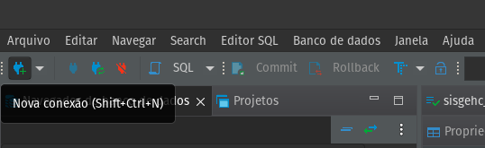
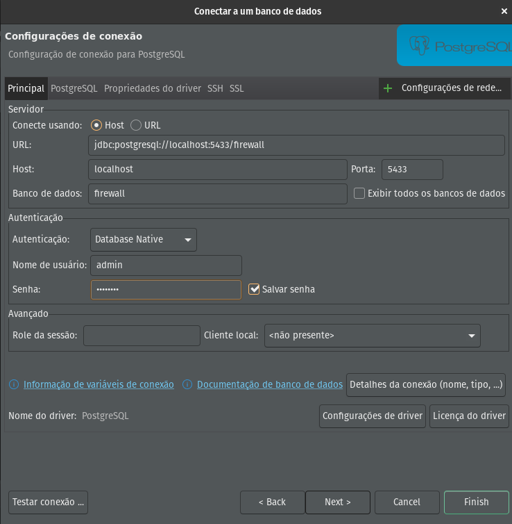
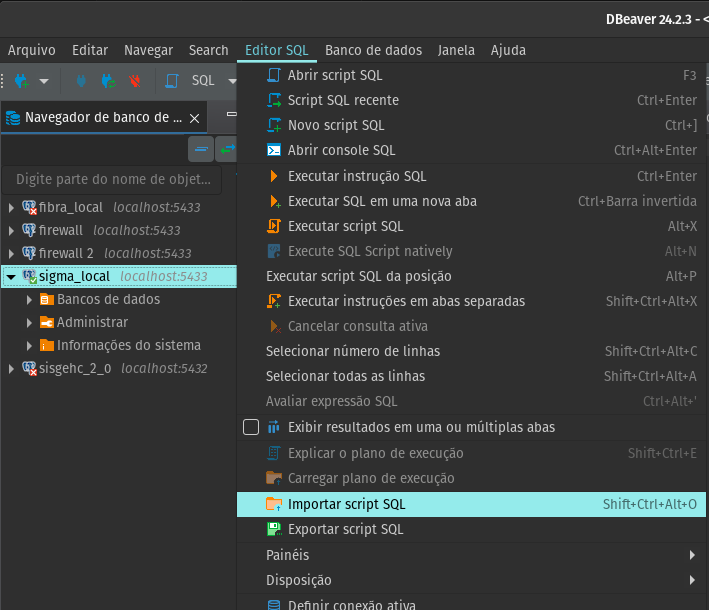
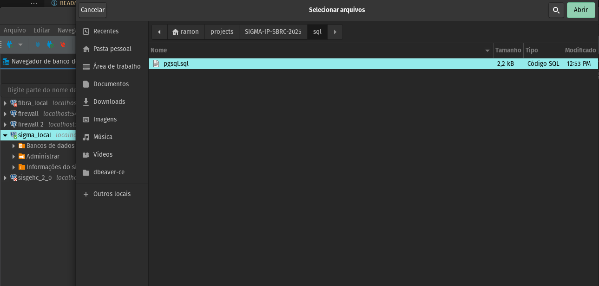
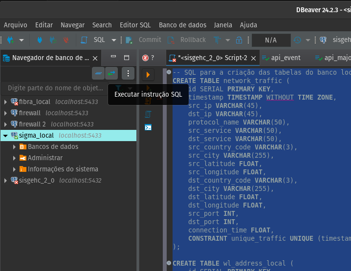

# SIGMA-IP 📕

Repositório dos códigos que compõem o SIGMA-IP, Firewall automatizado com integração de IA.

O objetivo dessa ferramenta é aumentar o nível de segurança de um firewall de borda evitando a negação inicial do serviço, enquanto é efetuada a análise do tráfego registrado.

## Dicas e Considerações de "Preflight"

Como a execução foi validada em um ambiente em nuvem pública, usando uma distribuição Linux específica, algumas considerações são necessárias:

- A distribuição usada para replicação desse guia foi a **Debian/Linux**. Caso utilize outra distribuição, alguns passos podem precisar de ajustes.

## Preparação do Ambiente

### Atualizando o Sistema
```sh
apt update -y
```

### Instalando o Git
```sh
apt install git -y
```

### Clonando o Repositório
```sh
git clone https://github.com/valderlan/SIGMA-IP-SBRC-2025.git
```

### Instalando Pacotes Necessários
```sh
apt install vim wget bash-completion \
    tcpdump net-tools curl telnet \
    nmap zip unzip cron python3-pip python3-venv -y
```

### Criando Ambiente Virtual
```sh
python3 -m venv .env
```

### Instalando Docker
```sh
curl -fsSL https://get.docker.com | bash
```

## Instalando GeoIP Update
```sh
wget https://github.com/maxmind/geoipupdate/releases/download/v6.1.0/geoipupdate_6.1.0_linux_amd64.deb

dpkg -i geoipupdate_6.1.0_linux_amd64.deb
```

### Configurando GeoIP Update
Editar o arquivo de configuração:
```sh
nano /usr/share/doc/geoipupdate/GeoIP.conf
```
A *MaxMind* precisa que seja feito um cadastro para a disponibilização dessa base. Sendo assim, após o cadastro devidamente feito, serão gerados o ```AccountID``` e a ```LicenseKey```. No caso, você pode usar esse ```AccountID``` e a ```LicenseKey``` disponibilizados no repositório, porém não requisite mais de uma vez para não acabar o limite diários da API. 

Obs: Você pode criar um login novo para você utilizar a base de geolocalização ou pode utilizar os dados já existentes no readme.


Sendo necessário apenas inserir essas informações no arquivo citado assim, como o exemplo abaixo:

```
AccountID 1042771
LicenseKey 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
EditionIDs GeoLite2-ASN GeoLite2-City GeoLite2-Country
```
Após a configuração, execute:
```sh
geoipupdate -f /usr/share/doc/geoipupdate/GeoIP.conf
```

## Ativa o ambiente virtual
```sh
. .env/bin/activate
```
## Da permissão de leitura escrita e execução para a venv
```sh
sudo chmod -R a+rwx .env
```
## Instala as bibliotecas necessárias
```sh
pip install -r requirements.txt 
``` 

## Criando e Executando Containers
### Postgres API
```sh
docker run --name sigmaip -e POSTGRES_PASSWORD=Q1w2e3r4 -e POSTGRES_USER=admin -e POSTGRES_DB=firewall -p 5433:5432 -d postgres:17
```

### Postgres Local
```sh
docker exec sigmaip psql -U admin -d postgres -c "CREATE DATABASE sigma_local OWNER admin;"
```

### Recriando o Banco
```sh
docker exec sigmaip psql -U admin -d postgres -c "DROP DATABASE firewall;" -c "CREATE DATABASE firewall;"
docker exec sigmaip psql -U admin -d postgres -c "DROP DATABASE sigma_local;" -c "CREATE DATABASE sigma_local;"
```

## Configurando o Postgres local

Abrir uma nova conexão e seleciona o PostgreSQL




Inserir as informações do banco e usuário na conexão



Importar Script SQL e selecionar o arquivo pgsql.sql, presente na pasta "sql"





Rodar as instruções SQL




## Rodando a API

É necessário criar um super usuário via Django, criar as migrations e aplicá-las. Após isso basta rodar o servidor.

```sh
python3 manage.py createsuperuser
python3 manage.py makemigrations
python3 manage.py migrate
python3 manage.py runserver
```

## Ativando Regras de Firewall
```sh
python3 /SIGMA-IP-SBRC-2025/firewall/rules.py
python3 /SIGMA-IP-SBRC-2025/firewall/tarpitrule5.py
```
## Executando o Sniffer de Rede
```sh
sudo /home/{usuario}/projects/SIGMA-IP-SBRC-2025/.env/bin/python3 collect/collect-pgsql-ipv4-tcp-syn.py
```
