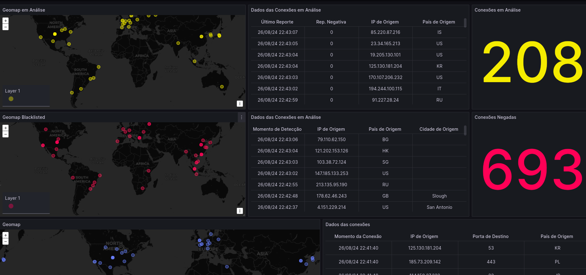

# Criando o ambiente localmente.

## 1. Ferramentas

Para criação/replicação do ambiente localmente, alguns dos passos citados no guia principal podem ser ignorados (e outros adicionados). Nesse guia será usada uma ferramenta de IaC (infraestrutura como código) chamada Vagrant para provisionamento da máquina e instalação dos pacotes básicos.

**Obs.: O uso da ferramenta é opcional, caso não haja familiaridade ou exista alguma dificuldade na configuração, a instalação da máquina virtual pode ser de forma convencional (ir direto para item 2)**

### 1.1 Configurações prévias

Para realizar a instalação do Vagrant no linux, basta acessar esse [link](https://developer.hashicorp.com/vagrant/downloads#linux)


### 1.2 Customização do arquivo

No início do arquivo existem duas variáveis que precisam ser alteradas para uso local e acesso externo ao ambiente virtualizado.

```bash
$route_ip = "GATEWAY_ADDRESS"        # Configure to your environment gateway ip address
$brdg_int = "NETWORK_INTERFACE"       # Configure to your environment NIC adapter
```

Para definir os valores de ambas as variáveis, é necessário executar o comando "ip route show" no *linux* ou "route print" no *windows*

```bash
#Exemplo de saída do comando em ambientes GNU/Linux

root@srv1:~# ip route show
default via 192.168.100.1 dev wlp1s0 proto dhcp src 192.168.100.147 metric 600 
169.254.0.0/16 dev wlp1s0 scope link metric 1000 
192.168.100.0/24 dev wlp1s0 proto kernel scope link src 192.168.100.147 metric 600 


#No caso, os valores necessários estão na linha "default". 

```

Editando o arquivo com os valores de exemplo ficaria:

```bash
$route_ip = "192.168.100.1"        # Configure to your environment gateway ip address
$brdg_int = "wlp1s0"       # Configure to your environment NIC adapter
```

### 1.3 Customização do arquivo

Apos o arquivo devidamente customizado, basta executar o comando ```vagrant up``` e a máquina será baixada, configurada e estará pronta para execução dos demais passos.

Para acessar, basta executar o comando ```vagrant ssh```.

## 2. Realizar demais configurações de acordo com o [guia](https://github.com/mascosta/FIBRA-UECE/tree/main#baixando-e-armazenando-a-base-de-geolocaliza%C3%A7%C3%A3o)

## 3. Simulando acesso externo.

Após as configurações devidamente realizadas e o sistema no ar(docker, banco, scripts etc) faz-se necessária a simulação de conexão de endereços de IPs públicos e, para tal, será adotado o uso da ferramenta scapy. 

Basicamente a ferramenta realizará leitura de duas bases de dados, uma do banco de GeoIP (```fake.py```), que possui as referências geográficas dos endereços, e outra da base de blacklist inseria localmente no PostgreSQL(```fake-bl.py```).

O uso se fará da seguinte forma:

```bash

# Para simular endereços públicos gerais:

/opt/FIBRA-Larces/python/bin/python3 /opt/FIBRA-Larces/standalone/fake.py

# Para simular endereços públicos em blacklist:

/opt/FIBRA-Larces/python/bin/python3 /opt/FIBRA-Larces/standalone/fake-bl.py

```

Apos a execução, os endereços gerados randomicamente aparecerão na tela de exibição do grafana:


